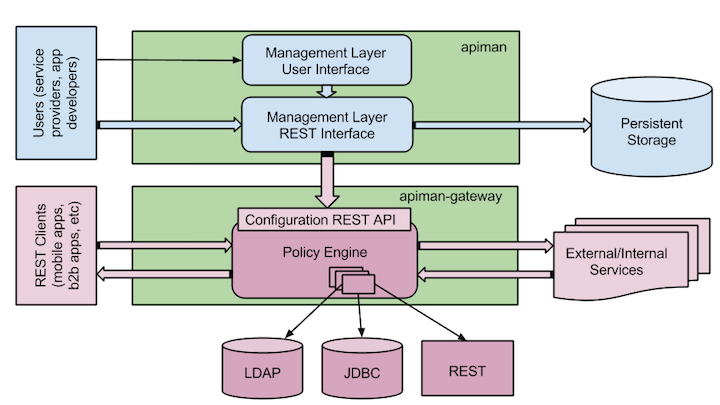

## Overview of the components shipped by apiman

The bottom half of the apiman component diagram below shows the apiman gateway. The gateway is a standalone application that functions as proxy between service consumers and producers. Requests are routed through a policy engine that applies a preconfigured chain of policies both on the way in (think of authentication policies) as well as on the way out (think of usage policies). Policies are plugins that if needed can connect to external systems to lookup authentication credentials such as LDAP, a JDBC store or a REST based call to an external system. The gateway component services runtime requests. 

The top half of the diagram show the apiman application itself. This application is used at design time by service producers to configure their service with policies, and or plans. Service consumers then agree to a certain plan and a contract can be set up between the two parties. More on this later. Once the desired policies, plans and contracts are in place, the service can be published to the gateway. The publish process is a REST based call from apiman to the gateway. At this point the service is live for consumption by application developers (service consumers).

.

_Overview of the apiman components_

### Apiman on Fabric8

Apiman is deployed on top of Fabric8 itself. This means that both apiman and the gateway are deployed as a microservice. This means that each app is a Kubernetes Service backed by one of more Kubernetes Pod instances. In each namespace you can run an apiman service and a gateway. Persistence is provided by using elasticsearch as a NoSQL datastore. You can run more then one pod for both apiman and the gateway to increase performance of these apps if needed.
