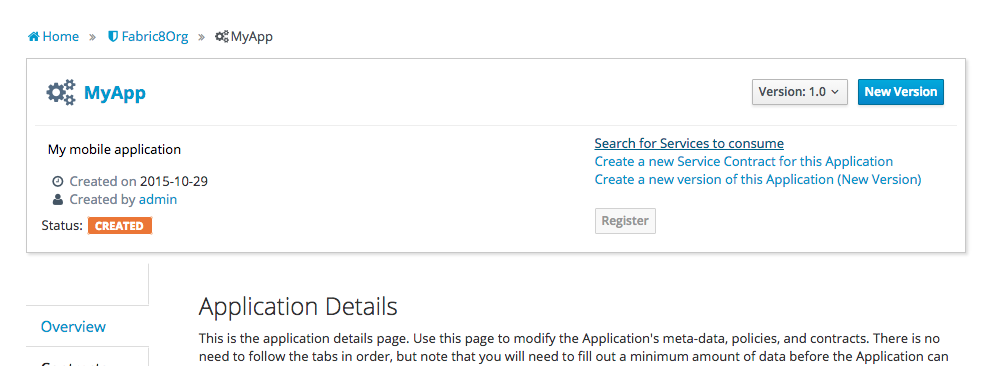
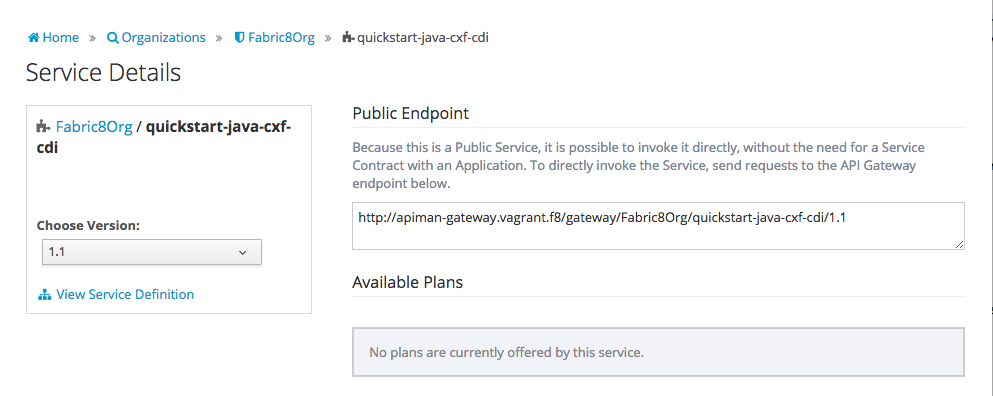
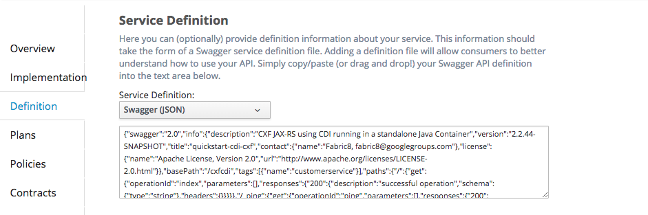
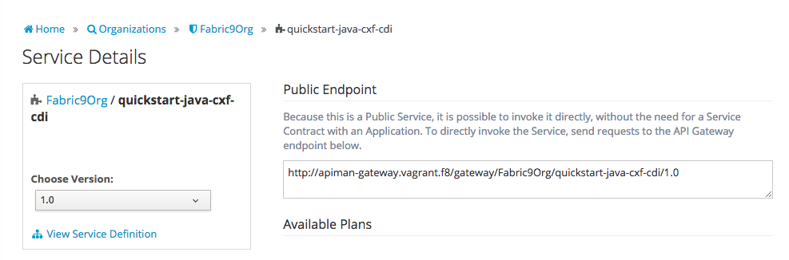

## Consuming a service from Fabric8 in your Application

### Create an Application
Application developers that want to consume services can 'Create an New Application' from the apiman dashboard screen. On the Application screen you can do a 'Search for Services to consume'. Find the quickstart-java-cxf-cdi service

.

and once found a selected you should notice that in the 'Choose Version' selector you have the option to consume either version 1.0 or version 1.1 of the service. 

.

Also note that there is a 'View Service Definition' link which brings you to a great api documented generated from the swagger.json the service developer imported earlier.

### Swagger

During the 'Publishing of the Service' we talked about the service developer setting the definitionType and definitionUrl. If these were set, Apiman can import the Swagger 2.0 JSON during the service import Alternatively the service developer can manually paste the swagger.json into the service definition.

.

As mentioned above Service consumers will be presented with a link to the service definition api document

.

which is a full description of the API of the service along with sample requests, responses statuses and exceptions.

.

Since the service developer published the service as a 'Public Service' the application developer can simply start using the endpoint
'To directly invoke the Service, send requests to the API Gateway endpoint below'. 

### Service Plans and Contracts

Now that you have had your first experience with Apiman, you probably want to create version 1.2 of the CDICXF service and _not_ make it public this time. Now try setting up some plan, policies and contracts between service developers and consumers. Please follow the [Apiman Docs](http://www.apiman.io/latest/user-guide.html) if you need help with that.

