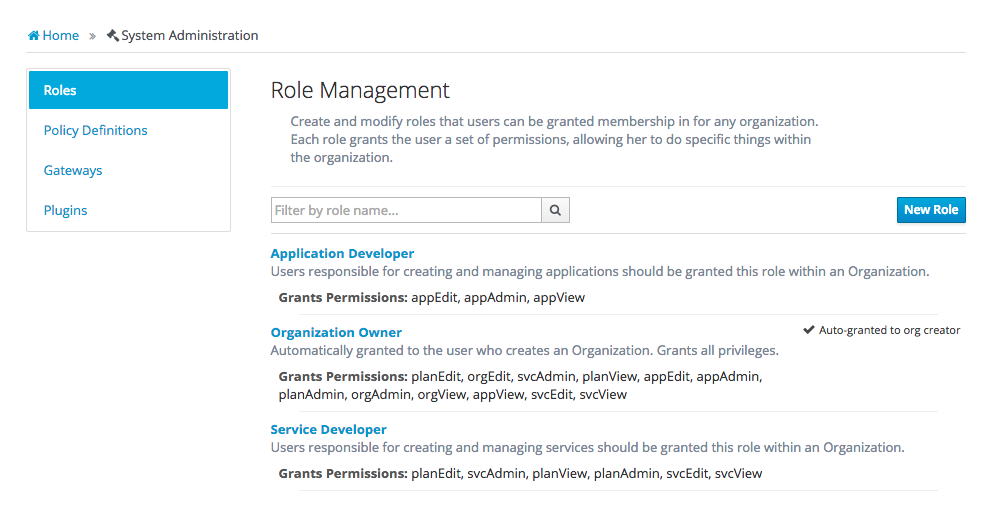
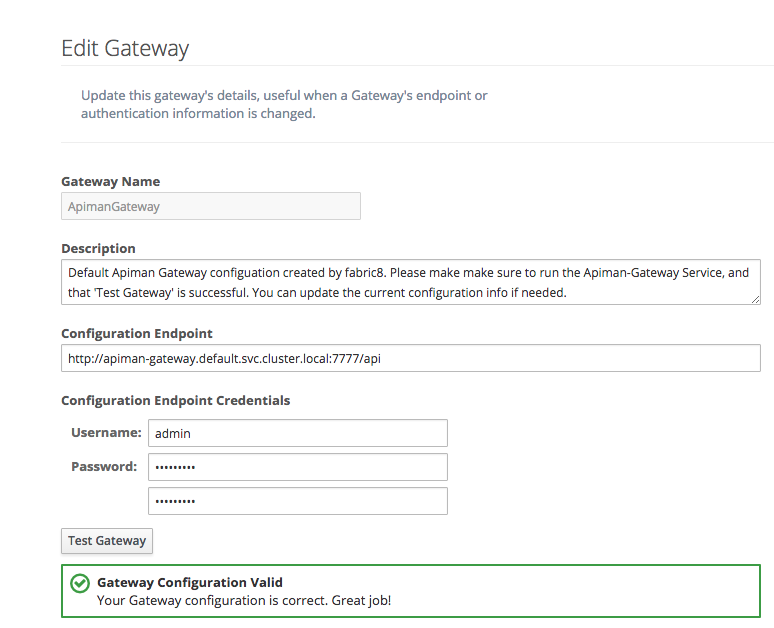

## Getting started

Getting started is easy, you must run the **apiman** app group:

* Click on the **Run** button on the top right to run **apiman** 

This app group starts a three applications: 'apiman', 'apiman-gateway' and 'elasticsearch'. The apiman application provides the Management configuration layer, which consists of a REST layer and a User Interface, the apiman gateway application is the gateway. For the configuration layer and the Gateway to work properly, it will start an elasticsearch service if one wasn't already running. Elasticsearch is used for persistence by both apiman management app as well as the apiman Gateway, the latter only if you use policies that need to share request count state between pod instances. 

When all these applications are running you can see the console at the apiman url 

* In the [Console](console.html) click on **API Management**.

and if you run in vagrant this url would be http://apiman.vagrant, but there are also entries in the menu navigation to get to 'API Management'. The apiman dashboard will show. If this is the first time you launch it, please go into the Admin section and check that the bootstrap process loaded the Roles, Policy Definitions and the apiman gateway.

.

_Roles_

.

_Policy Definitions_

.

_APIManGateway_

In the apiman gateway screen you can click the **Test Gateway** button to check that apiman can interact with the apiman gateway.

The apiman gateway is implemented as a kubernetes service itself. This means that all configuration options for a kubernetes service apply to the gateway as well. If you require loadbalancing you should set '-Dhttp.keepAlive=false' or else it will try to keep connections alive. This in effect means that it only switches on failover.
