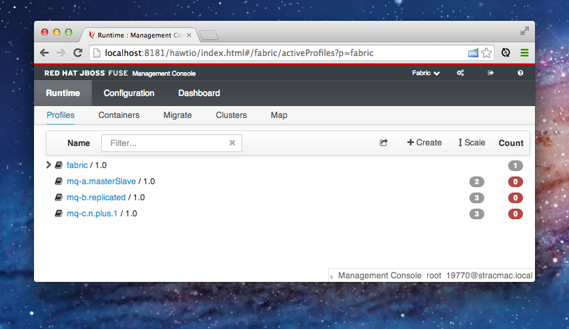
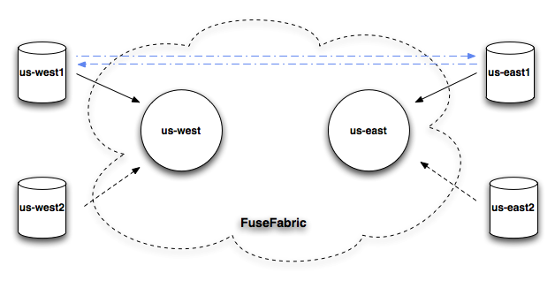

## Broker Topology

Fabric8 allows you to easily define [A-MQ message broker topologies](http://www.jboss.org/products/amq) either via the command line, JMX or via the Fuse Management Console.

Firstly brokers are put into logical groups. A logical group is then used for discovery. So messaging clients just connect to a group & they don't care which broker in the group they connect to.

There are a few different ways to configure Logical Brokers which map to 1 or more physical brokers.

## A. Master / Slave Broker

In master slave we create a logical broker in a group. e.g. group A, broker1 and broker2.

Now we've 2 logical brokers. Each of these 2 logical brokers gets a Fabric profile. We can run 1 or more instances of each.

If we run 2 instances of broker1 profile in 2 separate containers; one is the master the other is the slave (with failover).

## B. Replicated Broker

In replicated mode you run N replicas of the same logical broker. Typically you'd run, say, 3 replicas; typically inheriting from the **mq-replicated** profile.

So you'd have 1 profile for a replica set of brokers and you deploy 3 instances of that container.

## C. N + 1 Broker

In N + 1 you define N brokers (broker name and configurations) in a group. e.g. group A has broker1 and broker2. Then you create N+1 containers each having all the N brokers inside.

This maps to a single profile for the N+1 group, which contains broker1 and broker2; then you'd run 3 of these containers; with 2 of the containers being master and one being slave to the other 2 brokers.

The **standby.group** (which defaults to the group) is used to ensure that each container is only master of 1 logical broker; to avoid running 3 containers and 1 of them being master of both broker1 and broker2

## Store and forward networks

Store and forward networks are excellent way to connect geographically dispersed brokers. You can have a broker group for the US east region and another group for US west region. Then clients can connect to their local broker, but we still can pass messages between
 regions through store and forward network. We can easily network brokers from different groups, by defining the **networks** property in the profile.

## Implementation details

Each logical Master/Slave broker, Replicated broker set, or N + 1 group of brokers maps to a Profile in Fabric. Each will have a single broker inside the profile configuration - apart from (C) N+1 Broker which will have N broker configurations.

Broker configurations are defined by the file: **org.fusesource.mq.fabric.server-$brokerName.properties** inside the profile

## Using mq-create

There follows examples on how to create each of the 3 kinds of broker configurations using the comand line shell:

### Master / Slave

Lets create a logical broker in group *a* and have a master and slave

    mq-create --group a broker1

    container-create-child --profile mq-a-broker1 root broker1c1
    container-create-child --profile mq-a-broker1 root broker1c2

### Replicated

Lets create a logical broker in group *a* with a logical broker1 replicated in 3 replicas

    mq-create --parent-profile=mq-replicated --group a broker1

    container-create-child --profile mq-a-broker1 root broker1c1
    container-create-child --profile mq-a-broker1 root broker1c2
    container-create-child --profile mq-a-broker1 root broker1c3


### N+1 with 2 brokers

Lets create a logical broker in group *a* and have a master and slave

    mq-create --profile broker1and2 --group a broker1
    mq-create --profile broker1and2 --group a broker2

    container-create-child --profile broker1and2 root brokerc1
    container-create-child --profile broker1and2 root brokerc2
    container-create-child --profile broker1and2 root brokerc3


### Try them all out

Copy/paste this example script to setup 3 profiles with a group each showing all the above in a demo:

    mq-create --group a --profile mq-a.masterSlave broker1
    mq-create --group b --profile mq-b.replicated --parent-profile=mq-replicated broker2
    mq-create --group c --profile mq-c.n.plus.1 broker3
    mq-create --group c --profile mq-c.n.plus.1 broker4

Then you'll have 3 profiles created, mq-a.masterSlave,  mq-b.replicated and mq-c.n.plus.1 which show master/slave, replicated, N+1 options with a profile for each.

So you're console should look like this (notice the scale column shows how many container instances are required for each profile).



* clicking on the red badges on the right then lets you create containers.
* clicking on the Scale button on the toolbar will let you scale up/down the number of instances of each logical broker
* if you run Fabric on a cloud with an Auto-Scaler (like OpenShift) then it will automatically spin up all the brokers for you (neat eh! :)


### Store and forward networks

To demonstrate networks, we will create a master/slave in two groups **us-east** and **us-west** and connect them



    mq-create --group us-east --networks us-west --networks-username admin --networks-password admin --create-container us-east us-east
    mq-create --group us-west --networks us-east --networks-username admin --networks-password admin --create-container us-west us-west

Now we can connect producer to **us-east** cluster

    container-create-child --profile mq-client-us-east --profile example-mq-producer root producer

and consumer to **us-west** cluster

    container-create-child --profile mq-client-us-west --profile example-mq-consumer root consumer

and they observe messages being passed through the route.


### Command Line

To create a new logical broker configuration use the **mq-create** command.

```
mq-create nameOfBroker
```
There are many command line options you can type