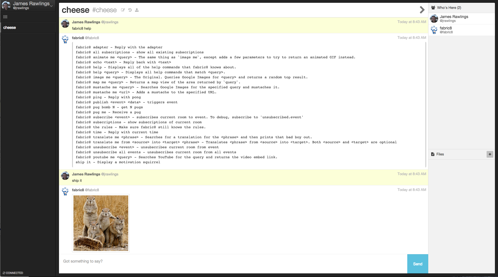

## Chat

DevOps is all about culture and teams efficiently deploying and managing software. Using Chat software is a great way to help the cultural and social side of DevOps.

There are various types of Chat software like IRC, Slack, HipChat, Campfire and so forth.

In Fabric8 we recommend the use of [Lets Chat](http://sdelements.github.io/lets-chat/) and we also suggest runnning [hubot](https://hubot.github.com/), an open source chat bot along with it.  Combining these two together enables extensible automation along with the all important communication channels that are required to take features from ideas through to running in a live environment, whilst also establishing those all important feedback loops.

Fabric8 comes with a hubot [app](apps.html) and a notification engine to post [build completion](builds.html) events to a chat room (which defaults to one room per kubernetes namespace).

### Installation
 
To install the Chat app please see the [Install Fabric8 on OpenShift Guide](fabric8OnOpenShift.html). Chat is included in the [Continuous Delivery](cdelivery.html), [iPaaS](ipaas.html) and [Kitchen Sink](fabric8OnOpenShift.html#kitchen-sink) apps.    

Once you have completed the above you should see the **Chat** item on the navigation bar of the [Console](console.html)

To install Hubot in the short term requires first a manual step.  

1. Set up a user in Lets Chat, say 'fabric8'   
2. Create a room and take note of the room id in the URL   
3. Generate an auth token from the Lets Chat user preferences   
4. Run Hubot by setting the template values you have just generated. e.g.   

e.g.

		oc process -v LETSCHAT_TOKEN=[ADD TOKEN HERE],LETSCHAT_ROOMS=[ADD COMMA LIST OF ROOM IDS HERE] -f http://repo1.maven.org/maven2/io/fabric8/jube/images/fabric8/hubot-letschat/2.2.0/hubot-letschat-2.2.0-kubernetes.json | oc create -f -

or using the fabric8 maven pugin...

		mvn fabric8:apply -Dfabric8.apply.LETSCHAT_TOKEN=[ADD TOKEN HERE] -Dfabric8.apply.LETSCHAT_ROOMS=[ADD COMMA LIST OF ROOM IDS HERE]

* Now register a **different** user in Let's Chat so that when you login hubot will join the room too. (You need 2 different users so that both you and Hubot can join the same room ;)
* Login as yourself

### How to use Chat in Fabric8

Click the **Chat** item on the navigation bar of the [Console](console.html). By default you are then prompted to enter your nickname (which defaults to the user name you used to work with the git repositories on the **Repositories** tab.

### Hubot

Hubot uses [scripts](https://github.com/github/hubot/blob/master/docs/scripting.md) to add functionality.  OOTB Hubot comes with a number of [coffee scripts](http://coffeescript.org/) that provide a base set of features.  To communicate with fabric8's bot you need to be in the chat room you configured hubot to listen to in the install step above.  Once there you can speak to the bot by typing 'fabric8'.  

When the hubot container is run it will clone [fabric8 hubot scripts](https://github.com/fabric8io/fabric8-hubot-scripts) and places all coffee scripts in a location that is used by hubot to automatically load when it starts.  This can be configured when applying the [hubot-letschat](https://github.com/fabric8io/quickstarts/tree/master/apps/hubot-letschat) appp by setting the `$LETSCHAT_HUBOT_SCRIPTS` env var.

To see what's available, in your chat client type..   

		> fabric8 help

