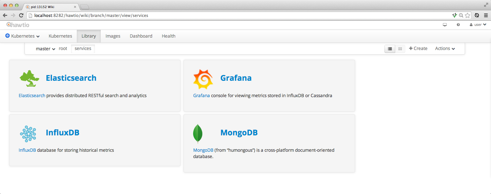

## Console

The Fabric8 Console provides a rich HTML5 web application for working with [Kubernetes](http://kubernetes.io/). The front end code is based on the [hawtio project](http://hawt.io/) which supports Kubernetes and reuses the various [hawtio plugins](http://hawt.io/plugins/index.html).

### Running the console on Kubernetes/OpenShift

From the command line tool for Kubernetes / OpenShift you should be able to create the console service and replication controllers via:

    kube create -f http://central.maven.org/maven2/io/fabric8/jube/images/fabric8/console/2.0.27/console-2.0.27-kubernetes.json

### Getting Started

The console has a number of tabs that let you work with the various Kubernetes resources. We'll highlight the main ones you'll need to use:

#### Controllers

The main tab to get a feel for what's running in your system is the **Controllers** tab which shows all the [replication controllers](replicationControllers.html).

To scale up or down a controller to run more or less [pods](pods.html) (containers) just increase or decrease the **Desired Replicas** value and hit **Save** and hey presto pods are created or destroyed.

#### Overview

The **Overview** tab gives you a feel for how all the various [services](services.html) and  [replication controllers](replicationControllers.html) interact:

#### Library

The **Library** tab lets you drag and drop [Apps](apps.html) into your library from downloaded [App Zips](appzip.md) so that you can see all the available applications you can run. Click on an app then hit **Run** to run them.

You can also drag folder from the Library to your desktop and local file system to save them.

### Using Kubernetes/OpenShift

If you are using Kubernetes or OpenShift you need to find the URL for the console service. From there you should be able to navigate to the tabs for [pods](pods.html), [replication controllers] and [services](services.html).

e.g. if you are using the command line after [installing fabric8](getStartedOpenShift.html) and you have setup the **kube** alias then you can find the IP and port thats running the console via:

    kube list services | grep hawtio

e.g.

    $ kube list services | grep hawtio
    hawtio-service                          name=hawtioPod      172.121.17.3        8080

So now in this case you can open the console at [http://172.121.17.3:8080](http://172.121.17.3:8080). The actual IP address may vary based on your installation. (We will use DNS names soon instead.)

Note that if you use the [single command installer](http://fabric8.io/v2/openShiftDocker.html#run-openshift-v3-using-docker) then a browser window with the console should open automatically.

### Using Jube

If you are using Jube then the web console should be visible at [http://localhost:8585/hawtio/](http://localhost:8585/hawtio/). You can then view these tabs:

 * [Pods tab](http://localhost:8585/hawtio/kubernetes/pods) views all the available [pods](pods.html) in your kubernetes environment
 * [Replication Controllers tab](http://localhost:8585/hawtio/kubernetes/replicationControllers) views all the available [replication controllers](replicationControllers.html) in your kubernetes environment
 * [Services tab](http://localhost:8585/hawtio/kubernetes/services) views all the available [services](services.html) in your kubernetes environment

