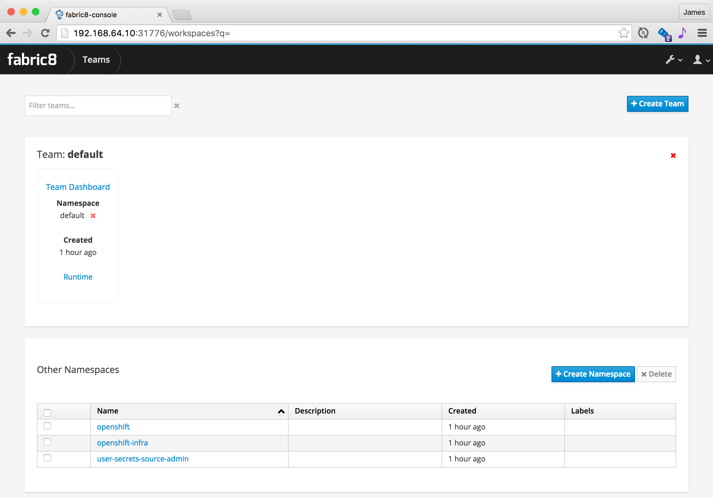
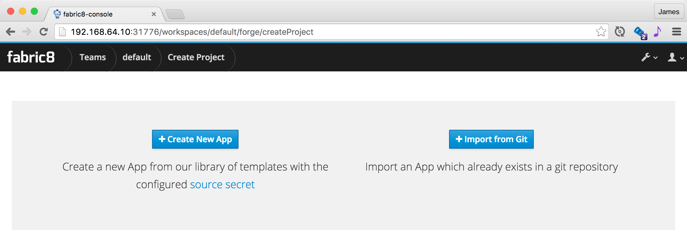
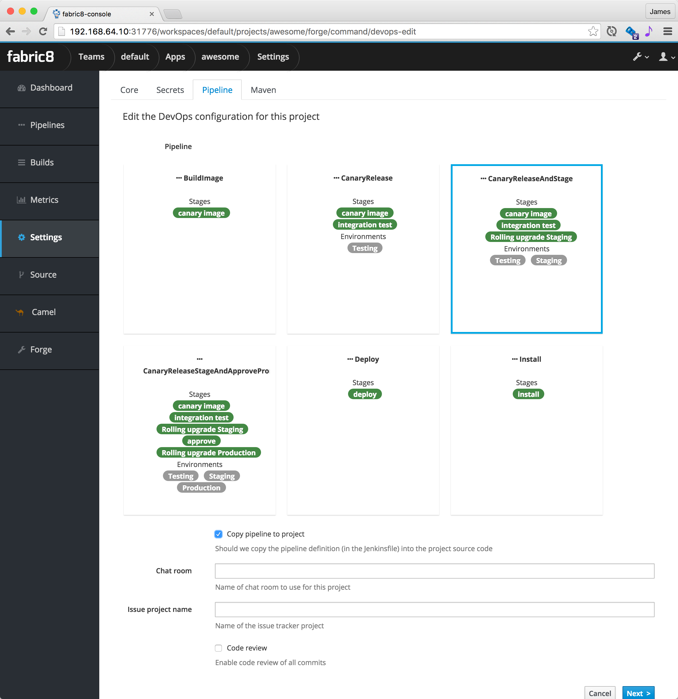
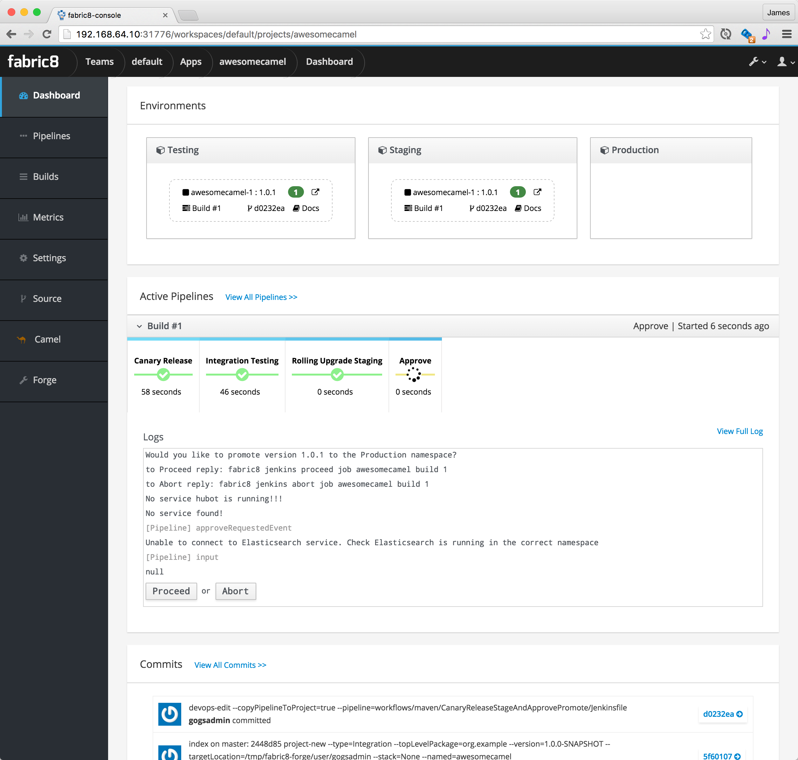

## Create a microservice

The easiest way to configure the Pipeline for your project is via the [fabric8 developer console](../console.html).

When you open the fabric8 console you should see a screen like this:

A `Team` is a kubernetes namespace running your development tools (like Jenkins, Nexus, JBoss Forge) and is associated with a number of environments (Testing, Staging, Production etc).

Click on the `Team Dashboard` which should take you to the Team Dashboard where you can create new apps or view your existing apps:

If you click the `Create Application` you get to the create wizard page:

Then you get to pick what kind of project you wish to create and its name:

Then choose your [CD Pipeline](cdelivery.html):

If you choose `Copy pipeline to project` then the Jenkinsfile that defines the pipeline gets copied into your project's git repository so that you can easily edit it later on via a versioned source code change just like any other code change.

Now you will be taken to the `App Dashboard` where you can see all the environments and active pipelines along with recent commits on a single pane of glass. This is how it looks once the Canary release, Testing and Staging is complete; waiting for Promotion to Production

You can click on the `Proceed` button to promote to Production, or `Abort` to stop the pipeline.

You can easily switch between all your development tools (Gogs, Jenkins, Nexus etc) using the tool drop down menu at the top right of the screen:

### Runtime tabs

The `Team` page has a `Runtime` tab that lets you browse the runtime of your development environment. Or from the home page you can click on an environment page to view its runtime.

The `Runtime` pages have a number of tabs that let you work with the various Kubernetes resources. We'll highlight the main ones you'll need to use:

#### Replicas

The main tab to get a feel for what's running in your system is the **Replicas** tab which shows all the [replication controllers](replicationControllers.html) or ReplicaSets on Kubernetes.

To scale up or down a controller to run more or less [pods](pods.html) (containers) just increase or decrease the **Desired Replicas** value and hit **Save** and hey presto pods are created or destroyed.

#### Overview

The **Overview** tab gives you a feel for how all the various [services](services.html) and  [replication controllers](replicationControllers.html) interact:

### Demo 

Here is a [video demonstrating how to create a microservice and then deploy and edit it via Continuous Delivery](https://vimeo.com/170830750)

  

      <iframe src="https://player.vimeo.com/video/170830750" width="1000" height="562" frameborder="0" webkitallowfullscreen mozallowfullscreen allowfullscreen></iframe>
  

  

    <a href="https://medium.com/fabric8-io/create-and-explore-continuous-delivery-pipelines-with-fabric8-and-jenkins-on-openshift-661aa82cb45a">more details in a blog post</a>
  

