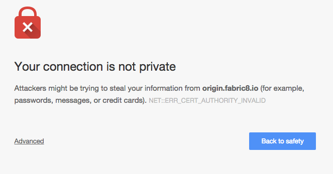
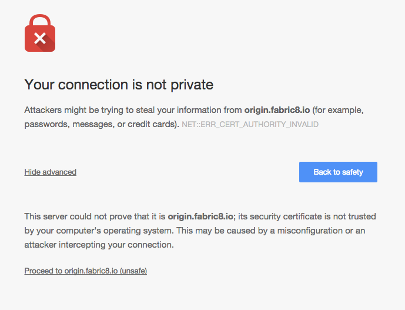
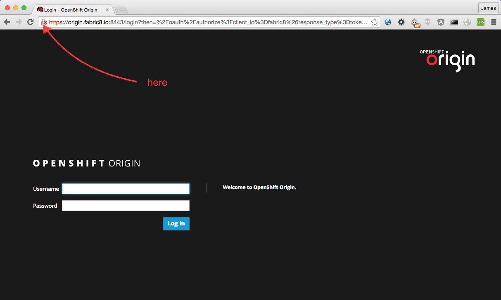
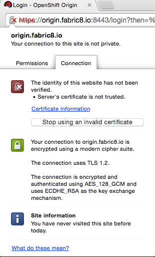
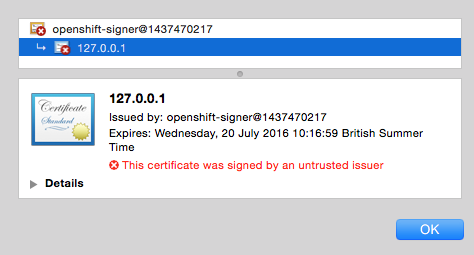
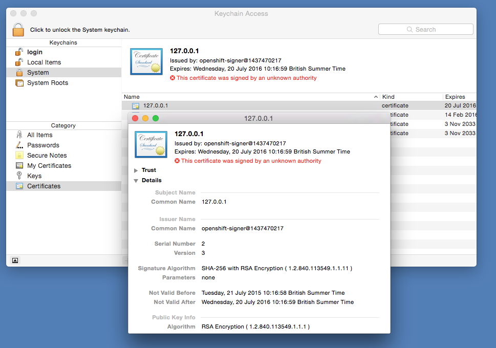
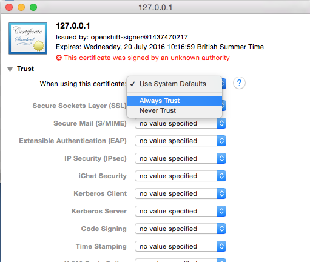
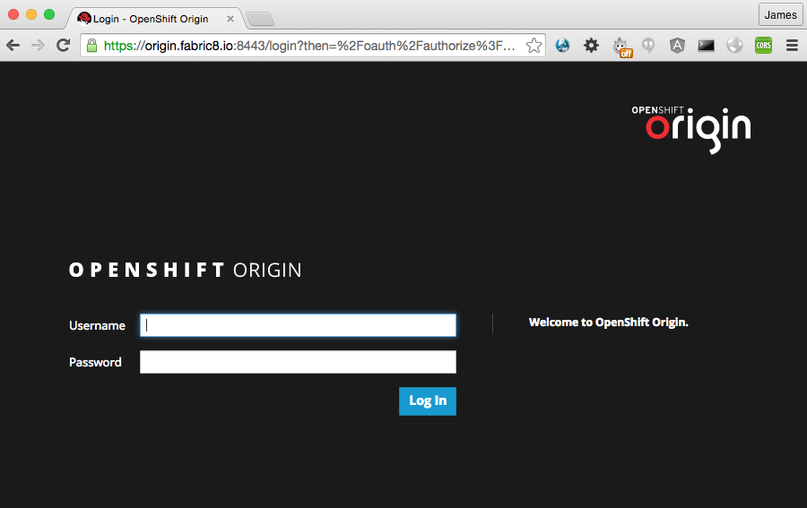

## Accepting the Self-Signed Certificate in Chrome

The console makes use of a self-signed certificate.  When you first try to access the console through Chrome you will likely be stopped by a page that looks like this..

This shouldn't cause concern and for more details why it appears it's worth vistiting [this blog](http://www.accuweaver.com/2014/09/19/make-chrome-accept-a-self-signed-certificate-on-osx/) which helped us understand how to accept the OpenShift self-signed cert.

Click 'Advanced' then 'Proceed to [your OpenShift master hostname]'

Now you will see the OpenShift login screen but before we enter our credentials we will get the certificate.  In the address bar you will see a lock icon with red cross over it.  Click it.

Select the 'Certificate Information' hyperlink

Drag the certificate image from the window onto your desktop

Adding the certificate to your system will depend on the OS you are using..

- [OSX](#osx)
- [Linux](#linux)
- [Windows](#windows)

### OSX
Open utility Keychain Access, select the 'System' keychain and 'Certificates' catagory

Drag and drop the certificate from you desktop into the main window.  You will be prompted for your system password, an issue has been seen where being able to type the password is not immediately available, if so please wait.

Double click the certificate, select Trust and 'Always trust' in the first drop down titled 'When using this certificate'

Close and you will be prompted for your system password again

Open up a new window and go to the fabric8 console again, you should be taken straight to the login page with a green lock icon in your address bar.

### Linux

_TO DO_

### Windows

_TO DO_
