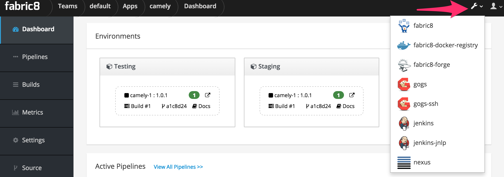

## Install Fabric8

The easiest way to get started with Fabric8 on your laptop or against an existing Kubernetes or OpenShift cluster is via [gofabric8](https://github.com/fabric8io/gofabric8/releases)

Note if you want to try the early access 4.x version of fabric8 on MiniShift then please [check out these instructions](https://github.com/fabric8io/fabric8-platform/blob/master/INSTALL.md)

### Prerequisites

Depending on your platform you may also need to install the following drivers:  

* Windows users will need to run this command as Adminstrator and will need to [enable Hyper-V on Windows 10](https://msdn.microsoft.com/en-us/virtualization/hyperv_on_windows/quick_start/walkthrough_install) or [Windows 7](https://blogs.technet.microsoft.com/schadinio/2010/07/09/installing-hyper-v-manager-on-windows-7/).
* OS X users  will need to [install the xhyve driver](https://github.com/kubernetes/minikube/blob/master/DRIVERS.md#xhyve-driver) which we try to automatically install via `brew` but you may want to install it just in case ;)
* Linux will need to [install the kvm driver](https://github.com/kubernetes/minikube/blob/master/DRIVERS.md#kvm-driver)


### Installing gofabric8

For OS X and Linux you can either install [gofabric8](https://github.com/fabric8io/gofabric8/releases) via this command: 

```
curl -sS https://get.fabric8.io/download.txt | bash
```

Or you can [download the gofabric8 binary for your platform](https://github.com/fabric8io/gofabric8/releases) and add it to your `PATH` 

```sh
export PATH=$PATH:$HOME/.fabric8/bin
```

### Starting the cluster

Start the cluster via this command:
```sh
gofabric8 start
```

This will download the necessary tools such as [MiniKube](https://github.com/kubernetes/minikube) to boot up a VM on your laptop to run a single node Kubernetes cluster, a docker daemon and install fabric8. 

This will also install [kubectl](http://kubernetes.io/docs/user-guide/kubectl-overview/) which is the main CLI tool for interacting with kubernetes clusters.

### Using OpenShift

If you'd like to use [OpenShift Origin](https://github.com/openshift/origin) instead of [Kubernetes](https://github.com/kubernetes/kubernetes/) then just add the `--minishift` argument like this:

```sh
gofabric8 start --minishift
```

This will then use [MiniShift](https://github.com/jimmidyson/minishift) instead of [MiniKube](https://github.com/kubernetes/minikube) to create the VM and setup a single node cluster.

This will also install [oc](https://docs.openshift.com/enterprise/latest/cli_reference/basic_cli_operations.html) which is the CLI tool for interacting with OpenShift specific resources in OpenShift clusters - you can also use [kubectl](http://kubernetes.io/docs/user-guide/kubectl-overview/) for interacting with Kubernetes resources on OpenShift clusters.

### Changing the VM Driver

By default the VM drivers used will be `hyperv` on Windows, `xhyve` on OS X and `kvm` on Linux.

If you wish to switch to a different VM driver you can specify the `--vm-driver` property. 

For example if you have installed [VirtualBox](https://www.virtualbox.org/wiki/Downloads) and wish to use that then type:

```sh
gofabric8 start --vm-driver=virtualbox
```

Note that we highly recommend using the default VM drivers (`hyperv` on Windows, `xhyve` on OS X and `kvm` on Linux) as they tend to work better and use less resources on your laptop than the alternatives.

### Changing memory or cpus

_Note_ due to current limitations of mini* you cannot change the default settings once a VM has beed created.  Instead you will first need to delete the VM using `minishift delete` or `minikube delete`.

You can configure the number of cpus or memory for the VM via arguments. To see all the possible arguments type:

```sh
gofabric8 help start 
```

e.g. to configure the memory in MB or number of CPUs:

```sh
gofabric8 start --memory=6000 --cpus=2
```

### Validating your cluster

At any point you can validate your cluster via:

```sh
gofabric8 validate
```


### Access the Fabric8 Developer Console

To open the [Fabric8 Developer Console](../console.html)  type the following:

```sh
gofabric8 console
```

Then a browse window will open for the console. 

To see the URL so you can open it in another browser you can type:

```sh
gofabric8 service fabric8 --url
```

You can use the same command to open other consoles too like gogs, Jenkins or Nexus

```sh
gofabric8 service gogs
gofabric8 service jenkins
gofabric8 service nexus
```

Though from the [Fabric8 Developer Console](../console.html) you can easily switch between all your development tools using the tool drop down menu at the top right of the screen:


 
#### Configuring Docker
 
To use docker on your host communicating with the docker daemon inside your MiniKube cluster type:

```sh
eval $(gofabric8 docker-env)
```

## Troubleshooting

Check out the [troubleshooting guide](troubleshooting.html) for more help.
