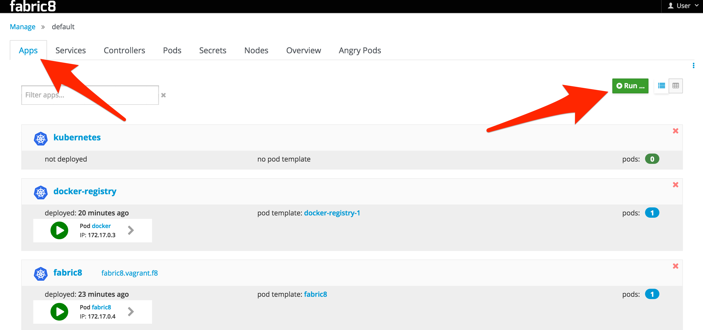
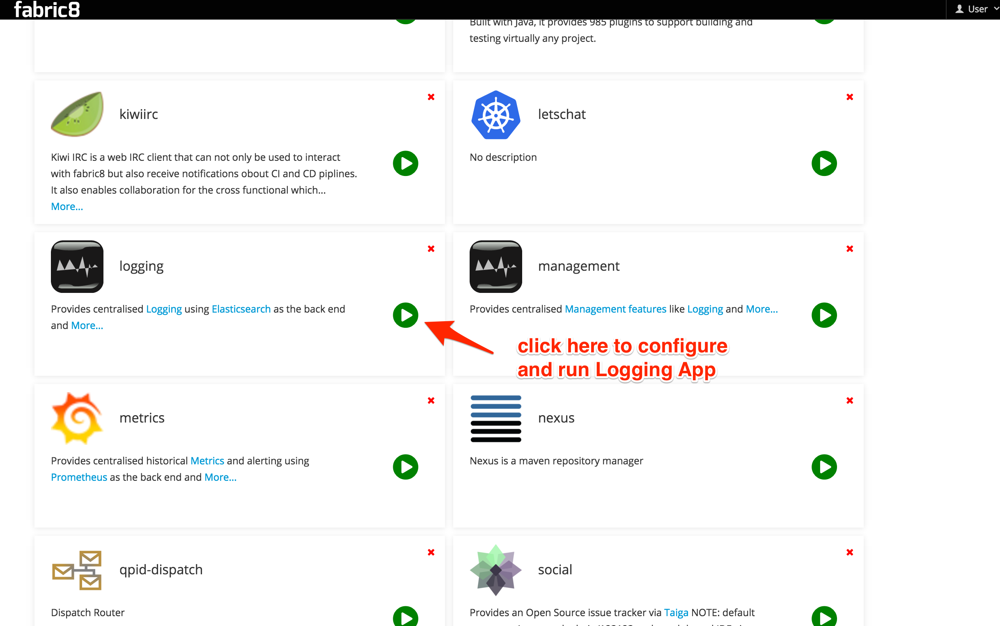
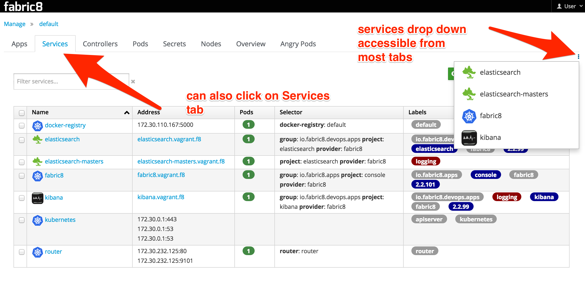

## Logging

Logging is a key part of being able to maintain and understand distributed systems. Consolidating log statements and events and being able to query and visualise them is an extremely useful tool.

With fabric8 we recommend using:

* [Elasticsearch](http://www.elasticsearch.com/products/elasticsearch/) as the back end storage of logs and events in your system as its easy to scale, provides replicated data for resilience and is very easy to query using complex structural and textual queries
* [Kibana](http://www.elasticsearch.com/products/kibana/) as the console to view, query and analyze the logs
* to collect the logs we tend to use this [logspout fork](https://github.com/jimmidyson/logspout) which is a small docker container for collecting logs which appends the docker and kuberentes metadata. Or you can use [LogStash](http://www.elasticsearch.com/products/logstash/) directly inside a container if you wish

Using [Elasticsearch](http://www.elasticsearch.com/products/elasticsearch/) on Kubernetes makes it easy to scale the ES cluster on the server side as well as discover the cluster for clients using [Kubernetes Services](http://kubernetes.io/v1.0/docs/user-guide/services.html). Your existing methods of logging directly to an ES cluster will work just fine, however, consider automated log spooling from Docker containers directly to ES using something like [fluentd](http://www.fluentd.org)

### How to use Logging in fabric8

If you are running Fabric8 with the [Fabric8 Console](console.html) then go to the **Apps** tab and click **Run**:

Then click on the "Logging" App. You can then enter the base domain name for your Kubernetes/OpenShift cluster for the `Route host name suffix` field (this will generate an OpenShift route for you. We are working generating the Kubernetes Ingress definition for vanilla Kube [#5567](https://github.com/fabric8io/fabric8/issues/5567)). You can optionally turn this off by clicking the checkbox. This should install Elasticsearch Master nodes and the Kibana UI as Kubernetes pods. It will also set up Kubernetes replication controllers and Services for you. For example, if your base Kubernetes cluster is at `vagrant.f8` then the App will be set up with services at `kibana.vagrant.f8` and `elasticsearch.vagrant.f8`. 

Once the Logging App is running (watch the pods start up in the fabric8 console!) you can find the service you'd like to access and navigate to it. You can do this by selecting the `Services` tab, or the little vertical ellipses that has a Services drop-down chooser:
 
 

### Setting up Fluentd

If you're using the [Fabric8 Vagrant Image](getStarted/vagrant.html), you're in luck! fluentd is [already configured as a static pod](https://github.com/fabric8io/fabric8-installer/blob/master/vagrant/openshift/Vagrantfile#L233). 

If not, you'll need to set up the fluentd pod on each node in your Kubernetes/OpenShift cluster. 

There are many ways to set up fluentd, but there are a couple fluentd plugins we recommend you use so that you have more kubernetes-context available in your log structures:

* [fluent-plugin-elasticsearch](https://github.com/uken/fluent-plugin-elasticsearch)
* [fluent-plugin-kubernetes_metadata_filter](https://github.com/fabric8io/fluent-plugin-kubernetes_metadata_filter)

We also have [a docker image that can be used which combines these plugins out of the box with a rich set of configuration options](https://hub.docker.com/r/fabric8/fluentd-kubernetes/) so you don't have to muck around with fluentd yourself. The easiest way to install fluentd like this on your Kubernetes cluster is to create a [static pod](http://kubernetes.io/v1.1/docs/admin/static-pods.html) (although static pods are soon deprecated in favor of [Daemon Sets](http://kubernetes.io/v1.1/docs/admin/daemons.html)) using a pod manifest like this:

    apiVersion: v1
    kind: Pod
    metadata:
      name: fluentd-elasticsearch
    spec:
      containers:
      - name: fluentd-elasticsearch
        image: fabric8/fluentd-kubernetes:v1.9
        securityContext:
          privileged: true
        resources:
          limits:
            cpu: 100m
        volumeMounts:
        - name: varlog
          mountPath: /var/log
        - name: varlibdockercontainers
          mountPath: /var/lib/docker/containers
          readOnly: true
        env:
        - name: ELASTICSEARCH_HOST
          value: elasticsearch
        - name: ELASTICSEARCH_PORT
          value: "9200"
      volumes:
      - name: varlog
        hostPath:
          path: /var/log
      - name: varlibdockercontainers
        hostPath:
          path: /var/lib/docker/containers
          
This will create a pod that bind-mount the Node's docker container folders so that it can slurp up the logs from STDOUT from the docker containers.

